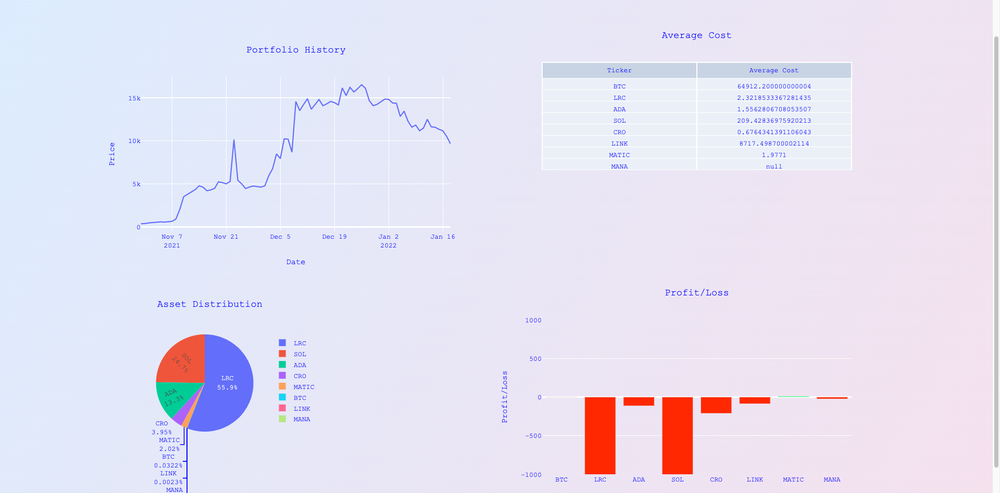

<h1 align="center">Crypto Portfolio Tracker</h1>
<h3 align="center">Web Application made with Flask and Python</h3>
https://crypto-portfolio-application.herokuapp.com/sign-up

Overview

- Built a website using python and flask backend and html and css frontend 
- Used Sqlalchemy for keeping track of database 
- Created plots with plotly offline and rendered using Jinja 
- Pulled daily closing prices from Coinbase API 

 Installation

1. Download or pull folder onto local machine

2. Initialize and activate the virtual environment:
    - Run python3 -m venv venv
    - .  /bin/venv/actiate
3. Install requirements:
    - pip install -r requirements.txt
4. Deploy server with flask run 

Features

- Login and signup feature using password hash 

- Transactions tab with adding new buy and sell transactions with date, quantity, and ticker

- Dashboard displaying your portfolio standings over time dynamically based on Coinbase API
- Piechart showing portfolio divisions
- Bargraph showing profits and losses of each asset held in your portfolio 

 Major Difficulties

- Finding the right data to provide a historical reference of pricing 
- Learning how to use plotly offline (initially wanted to use ggplot but could not find away to get timeseries to depict properly)
- Aligning and styling elements on the frontend
- Creating new dataframes to display data 

Future Considerations

- Finish the watchlist implementation
- Save data into a CSV so that if there are lots of transactions/pull requests from Coinbase API it doesn't lag, also append only new data for daily pricing as Coinbase API only does yearly 
    -- EDIT FINISHED. 
- Add more statistics on the dashboard page including total profit/loss, average price purchased of each asset
- Add different asset groups ie, equities, realesate
- Deploy live, tried to do with Heroku but very buggy 
    -- EDIT: In testing but seems to work https://crypto-portfolio-application.herokuapp.com/sign-up.
- Better user interface 
- Learn how to use Dash for a project like this 
- More buttons in the transactions modal group 

